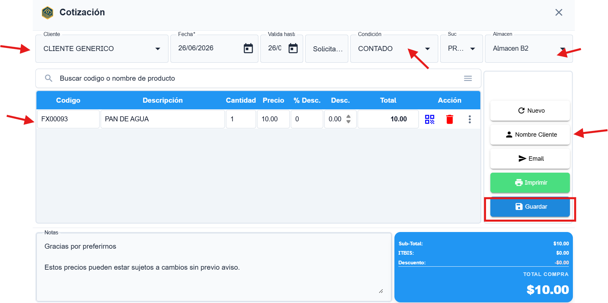

# Cómo crear una cotización en Finexa Cloud

1. En el menú principal, entra al módulo **ventas** le das doble clic a **cotizaciones** para ver el historial de cotizaciones.

2. Haz clic en el botón **"Agregar"** para crear una nueva cotización.

3. Selecciona el **cliente** al que deseas cotizar, usando el buscador de clientes.

4. Agrega los productos o servicios indicando cantidad, precio y descuentos si aplica.

5. Revisa los totales, impuestos y la condición de pago (por ejemplo, contado o crédito).

6. Completa otros campos necesarios, como moneda, notas u opciones especiales acordadas con el cliente.

7. Haz clic en **"Guardar"** para generar la cotización.

8. Después de guardar, podrás imprimirla, enviarla por correo o compartirla directamente desde Finexa Cloud.

**video tutorial**https://www.youtube.com/watch?v=TZtb7H1tsTA